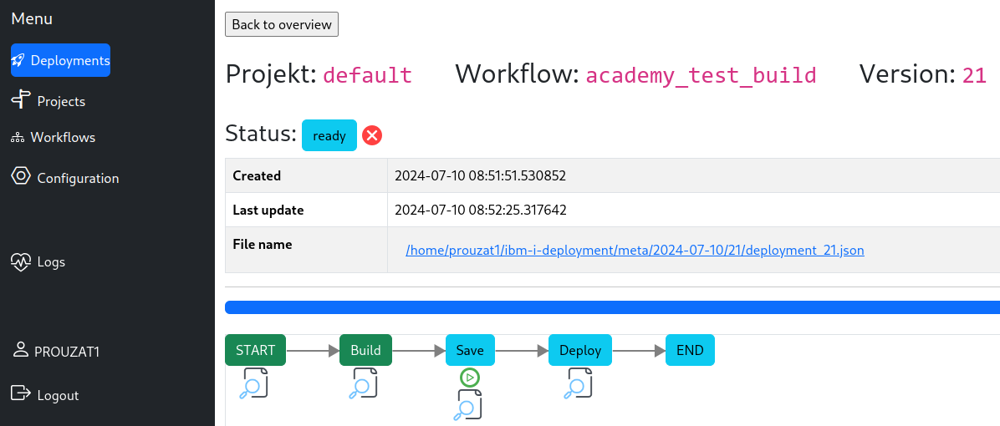
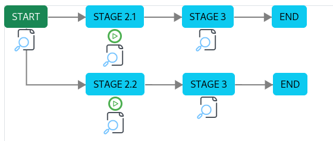
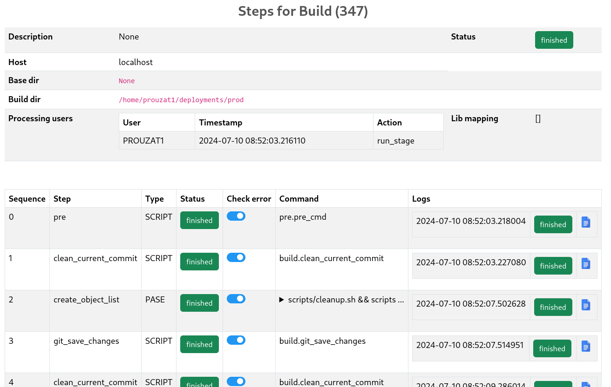
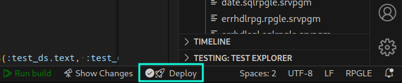
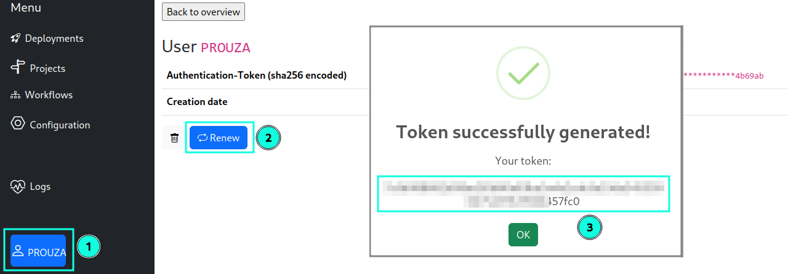

- [ i-Releaser: The new deployment tool for i](#-i-releaser-the-new-deployment-tool-for-i)
- [General process](#general-process)
  - [Features](#features)
  - [The setup](#the-setup)
  - [How to use it](#how-to-use-it)
  - [The concept](#the-concept)
  - [Interesting to know](#interesting-to-know)
- [Get started](#get-started)
  - [Requirements on IBM i](#requirements-on-ibm-i)
  - [Set up Python project](#set-up-python-project)
  - [Create a new deployment request](#create-a-new-deployment-request)
  - [Run stage](#run-stage)
- [Concept of this framework](#concept-of-this-framework)
  - [Detailed description](#detailed-description)
    - [Workflow name](#workflow-name)
    - [Stage](#stage)
    - [Run steps within a stage](#run-steps-within-a-stage)
- [Directory structure](#directory-structure)
  - [etc (configurations)](#etc-configurations)
  - [modules](#modules)
  - [scripts](#scripts)
- [Configuration files](#configuration-files)
  - [attribute "cmd"](#attribute-cmd)
- [Coverage](#coverage)


#  i-Releaser: The new deployment tool for i
 


This framework is used to organize the deployment workflow in different projects.

It's flexible and open and can be adabtet using configuration files.


# General process

## Features

* Can run under a profile with user class ```*USER```  
  No special authority needed.
* Individual workflows
* Graphical workflow overview
* Parallel workflow branches
  { width= 40%}
* Detailed tracking of each step and action
  { width= 50%}
* Separate logs for each task
* User specific commands for objects  
    For each object a user specific command can be defined which will be issued in addition.
* All functions can be accessed via WebAPIs
* IDE integration using [OBI IDE integration](https://github.com/andreas-prouza/ibm-i-build-obi)
  { width= 50%}


## The setup

1. Download this project
2. Unzip to a directory of your choice on your IBM i
3. Open a terminal on IBM i and navigate to this directory
   See [SSH setup](https://github.com/andreas-prouza/ibm-i-build/blob/main/docs/pages/SSH.md) you haven't used it before
4. Run the setup script ```./setup.sh```
5. Start the web server
   ```sh
   [andreas@idev webapp]$ cd webapp
   [andreas@idev webapp]$ ./service start
   Activate virtual environment: i-releaser/webapp/venv/bin/activate
   Start service
   Service is running ...
   andreas    63909   63905 19 16:53 pts/0    00:00:00 gunicorn: master [wsgi:app]
   andreas    63911   63909 31 16:53 pts/0    00:00:00 gunicorn: worker [wsgi:app]
   andreas    63913   63909 27 16:53 pts/0    00:00:00 gunicorn: worker [wsgi:app]
   andreas    63914   63909 29 16:53 pts/0    00:00:00 gunicorn: worker [wsgi:app]
   andreas    63918   63905  0 16:53 pts/0    00:00:00 grep gunicorn
   [andreas@idev webapp]$ 
   ```

Port & Co are defined in ```etc/gunicorn.conf.py```.


## How to use it

1. You call [WebAPIs](docs/webapi.md) of this service to ...
   * create a new deployment request
   * run stages
   * retrieve deployment information
2. In ```etc/workflow.json``` you have to define the stages, steps, environment and process of your deployment like ...
   * ```build_dir```  
     Project directory
   * ```hostname```
3. Generate a new API-Token for your HTTP access
   
4. When using [OBI](https://github.com/andreas-prouza/ibm-i-build-obi) you can integrate it in your IDE  
   Add the following settings into your ```etc/global.cfg```config:
   ```toml
   DEPLOYMENT_UAT_URL=https://my-ibmi
   DEPLOYMENT_UAT_WORKFLOW=standard_build
   DEPLOYMENT_UAT_MAIN_BRANCH=main
   DEPLOYMENT_AUTH_TOKEN=9999999999999999999999999999999999999999999999999999999999013320
   ```
   Then you can use the deployment button:
   { width= 50%}


## The concept

There are 2 parts:
* The deployment tool  
  It handles the deployment process
* [OBI IDE integration](https://github.com/andreas-prouza/ibm-i-build-obi)
  Creates a new deployment


1. The [OBI IDE integration](https://github.com/andreas-prouza/ibm-i-build-obi) creates a new release branch (containing the version number)
2. The deployment tool should build all from a "production" project folder in the IFS.  
   This should be used for production builds only.
3. Run steps of this deployment (e.g. in web frontend)


## Interesting to know

* The tool checks if the same commit is already in use in an existing deployment.  
  To use the same commit multiple times is not allowed within the same worfklow.
* If you need a emergency deployment you can define a HotFix worfklow for this.
* It's not possible to run multiple deployments in parallel.  
  You first have to finish all previous open deployments.  
  You can cancel them, if you don't need them anymore.


# Get started

## Requirements on IBM i
* Python
* ODBC

Follow [this setup](https://github.com/andreas-prouza/python-webapi?tab=readme-ov-file#setup-your-webapi).


## Set up Python project

Use the ```setup.sh``` script for it.
```sh
$ ./setup.sh
```

## Create a new deployment request

You can use
* [WebAPIs](docs/webapi.md) 
* or call the Python script directly

Run the python `deployment.py` script to create a new deployment request (meta file).  
This script expects 2 parameters:

* -a / --action create
    
    Creates a new deployment request

* -w / --workflow
    
    The name of the workflow which will be used

* -o / --object-file-list
  
    The name of the file containing the deployment objects.

```sh
python deployment.py -a create -w default_workflow -o prod_obj.txt
```

The directory meta file and its file name is defined in the `./etc/constants.py` script. It's the variable `C_DEPLOY_META_FILE`.


## Run stage

Run the python `deployment.py` script to run a stage of a deployment request (meta file).  
This script expects 2 parameters:

* -a / --action run
  
    Run a stage

* -d / --deploy-version

    Version (id) of the deployment

* -s / --stage
  
    Provide the stage name, which should be run.
    The stage musst be in the "current stage list"

```sh
python deployment.py -a run -d 4711 -s START
```


# Concept of this framework

Workflow with example

```
workflow (default)
    |   workflow.json
    |
    |--> Stage (START)
    |    |
    |    |
    |    |--> Next stages (UAT, ARCHIV)
    |    |      Name of the stages, which will be called when the current stage finished its processing
    |    |
    |    |--> Stage commands
    |    |      stage_commands.json
    |    |       This is a global definition for all workflows.
    |    |       Commands to run at this stage
    |    |       This is in addition to the steps to process for this stage
    |    |
    |    |--> Steps 
    |         |  ... to process at this stage (pre, post, ...)
    |         |
    |         |--> Commands
    |               |
    |               |--> defined in constants.py (C_STEP_2_CMD_MAPPING)
    |               |
    |               |--> in addition all object commands for this step
    |               |       object_commands.json
    |               |
    |               |--> Sub commands
    |
    |--> Stage (UAT)
```


## Detailed description

### Workflow name

Multiple workflows can be defined.  
Each of them needs a unique name.

It contains the step chain and what to do at each step.  
In addition a user specific list of steps & cmds can be defined here.

### Stage

A stage is collection of steps to run.  
A development cycle went through multiple stages (enviroments).

A stage can have one ore more following stages defined.  
So, if multiple stages are defined as follower (next_stages), they will run in parallel.

E.g.:  
```
START --> Development --> Test (UAT) --> Production --> END
                            |
                            |----------> Archive    --> END
```

Each step has definitions what is necessary to do here. --> Running steps (see next chapter).


### Run steps within a stage

Each stage has its definition which steps needs to run.  
There are a couple of steps available. Only the necessary steps can be defined. It's not necessary to define all of them.  
The scripts for the steps are located in the directory: `scripts`.

The order to run these steps, will be taken from the order in the list of the step (`processing_steps`).

The following are the available steps in that order:

1. pre (`pre.py`)
    
    A user defined function will be run here.

2. save (`save.py`)
  
    Save objects to a save file.

3. target-prepare (`target_prepare.py`)

    Creates on the target system:
    * Deployment library
    * Backup library
    * SAVF for each library of objects which will be deployed.
  
        This SAVF will be used to save the old objects.

4. transfer (`transfer.py`)
  
    Transfer objects to the target system (host) which is defined in the stage settings.

5. backup-old-objects (`backup_old_objects.py`)
  
    Do a backup of the old objects on the target system.

6. perform-deployment (`target_deployment.py`)

    Run the deployment on the target host.

7. post (`post.py`)

    If it's necessary to run some stuff at the end.


These scripts can be replaced by your own one, if you want some other stuff to run.


# Directory structure

Below you will find a list of directories, the containing files and the description.

* etc
    
    Configurations

* log
* modules
    
    Core scripts

* meta
    
    Meta-files (json) containing the deployment information

* scripts
    
    Can be used for defined steps in you workflow process


## etc (configurations)

* constants.py
  
    Contains all constants used in the scripts like:
    
  * codepage
  * directory names
  * file name templates

* deploy_version.json
  
    History of deployed versions

* default_step_action.json
    Default action definitions for some steps


* logger_config.py
  
    Logger configuration (filename, debug level, ...)
  
* object_commands.json
  
    Specify commands to get run for specific objects
  
* stage_commands.json

    Specify commands to get run for specific stage
  
* workflow.json

    Define stage workflow and its attributes


## modules

This folder contains all internal modules which are necessary to run this framework.

This is a collection of classes and functions.

E.g.: `meta_file.py` (Meta_File class) which will handle all stuff with meta files:
* save & read json files
* several checks
* stores object structures
* execution history of each object
* etc.


## scripts

All scripts in this folder can be used in any json-config file where a cmd can be defined.


# Configuration files

Below some descriptions to the JSON config files you need to know.


## attribute "cmd"

Depending on the command type, the command can be a shell command, or it can also be a function of a python script.

command types:
* QSYS
  
  Call of IBM i commands

* PASE
  
  Call of shell commands

* SCRIPT
  
  Call of a python function from a script


To run python functions, the syntax is:

`"cmd": "{script-name}.{function-name}"`

E.g.:

`"cmd": "pre.pre_cmd"`

This will execute from script `pre.py` the function `pre_cmd`.


# Coverage

https://coverage.readthedocs.io/en/6.0/source.html